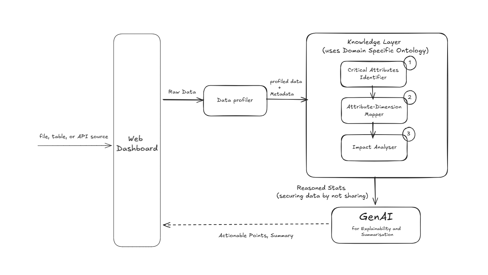

# ❤️ HeartBreakers  
### GenAI Agent for Universal, Dimension-Based Data Quality Scoring (Fintech Domain)

> **Problem Statement**  
> *An ontology-driven semantic approach embedded with evolutionary algorithms to assess dataset quality, with GenAI enabling explainability and insights.*

---

## 🎥Working Demo
https://vimeo.com/1152638341

## 📌 Overview

**Finova** is an intelligent **GenAI-powered data quality assessment system** designed for the **Fintech domain**.  
It introduces a **universal, explainable, and privacy-preserving Data Quality Scoring (DQS)** mechanism by combining:

- 🧠 **Ontology-driven semantic reasoning**
- 🤖 **GenAI for explainability and actionable insights**

Unlike static, rule-based scoring systems, our approach **understands data context**, **optimizes trade-offs dynamically**, and **explains results transparently**—without ever exposing raw sensitive data.

---

## 🎯 Problem Statement

Payment organizations process massive volumes of transactional data, yet:

- There is **no standardized way** to score data quality
- Existing methods rely on **static rules**
- GenAI-only approaches risk **hallucination and privacy leakage**

This project solves these gaps by delivering a **dimension-based, universal Data Quality Score (DQS)** across datasets.

---

## 🧩 Key Data Quality Dimensions

The system evaluates datasets across standard dimensions such as:

- Accuracy  
- Completeness  
- Consistency  
- Timeliness  
- Uniqueness  
- Validity  
- Integrity  

Each dimension receives:
- 📊 An individual score
- 🧮 Contribution to a **composite DQS**
- 📝 Clear, human-readable explanation

---
## 🏗️ Architecture Diagram

### 📌 End-to-End System Architecture

The diagram below represents the **semantic, privacy-preserving, and explainable architecture** of **HeartBreakers**, illustrating how datasets flow from ingestion to **Data Quality Scoring (DQS)** without exposing raw transaction data.


---
## 🏗️ Flow Diagram



---

### 🔍 Architecture Flow Explanation

#### 1️⃣ User & Interface Layer
- **User Interface (Next.js Dashboard)**  
  Enables users to securely upload datasets (file / table / API source) and visualize results.
- **API Gateway**  
  Acts as a controlled entry point enforcing governance, validation, and access policies.

---

#### 2️⃣ Data Profiling Layer
- **Data Profiler**
  - Extracts statistical summaries and metadata
  - Identifies schema, missing values, patterns, and distributions
  - Outputs **profiled data and metadata** without exposing raw data

---

#### 3️⃣ Knowledge Layer (Ontology-Driven Semantic Understanding)
This is the **core intelligence layer** of the system.

- **Critical Attribute Identifier**  
  Identifies attributes that significantly impact data quality.
- **Attribute–Dimension Mapper**  
  Maps dataset attributes to standard data quality dimensions
  (accuracy, completeness, consistency, timeliness, etc.).
- **Impact Analyzer**  
  Evaluates how each attribute influences overall data quality.
- **Domain-Specific Ontology**  
  Encodes relationships between attributes, dimensions, and domain context,
  enabling semantic reasoning instead of static rule-based logic.

📤 **Output:** Reasoned semantic statistics (no raw data).

---

#### 4️⃣ GenAI Layer (Explainability Only)
- Consumes **semantic reasoning outputs** from the ontology layer
- Generates:
  - Plain-language explanations
  - Dimension-level reasoning
  - Actionable data quality improvement recommendations
- **GenAI does NOT compute scores**
- Operates only on semantic abstractions, ensuring zero hallucination and high trust

---

#### 5️⃣ Output Layer (UI)
Displayed to the user:
- ✅ Composite Data Quality Score (DQS)
- 📊 Dimension-level quality scores
- 🧠 Reasoning and explanations
- 🛠️ Actionable improvement points

---

### 🔐 Privacy & Governance by Design

- Raw datasets never reach the GenAI layer
- Only semantic abstractions and reasoning facts are shared
- No transaction data is stored
- Fully compliant, auditable, and privacy-preserving

---

### 💡 Architectural Advantages

- Ontology-driven semantic reasoning (not static rules)
- Evolutionary-algorithm-ready design for trade-off optimization
- GenAI used strictly for explainability, not decision-making
- Reusable and extensible architecture across domains


---

## 🔐 Privacy & Governance by Design

- ❌ Raw transaction data never reaches GenAI
- ✅ Only metadata, semantic abstractions, and reasoning facts are used
- ✅ No data storage — only scoring outputs
- ✅ Fully compliant with governance and audit requirements

---

## 🧠 Why This Approach Stands Out

✔ Ontology-driven reasoning (not static rules)  
✔ Evolutionary trade-off optimization (not fixed scoring)  
✔ GenAI used **only** for explainability  
✔ Maximum privacy via semantic abstraction  
✔ Reusable and extensible framework across domains  

---

## 🗂️ Repository Structure
```text
HeartBreakers/
├── Frontend/ # Dashboard & UI
├── finova_backend/ # Core backend logic
│ ├── ontology/ # Domain ontology definitions
│ ├── profiler/ # Data profiling & metadata extraction
│ ├── evolutionary_algo/ # EA-based optimization engine
│ ├── genai/ # Explainability & summarization layer
│ └── api/ # Secure APIs
├── requirements.txt
├── .env.example
└── README.md
```
---

## 🚀 How It Works (High Level)

1. Dataset is securely ingested (file / table / API)
2. Data profiler extracts metadata and statistics
3. Ontology layer identifies:
   - Relevant attributes
   - Applicable quality dimensions
4. Evolutionary algorithm:
   - Optimizes dimension weights
   - Computes stable DQS
5. GenAI generates:
   - Explanations
   - Recommendations
6. UI displays scores, insights, and improvement paths

---

## 👥 Team – *HeartBreakers*


- **Shantharam**
- **Ashwin K**
- **Aswath Siddharth R**
- **R Darshan**

---

## 📄 License

This project is licensed under the **MIT License**.

---

## ⭐ Acknowledgements

- Anokha 2026 – 24 Hour Build2Break Hackathon

---

> *Building a new, standardized, semantic, and explainable future for data quality in Fintechs.*
